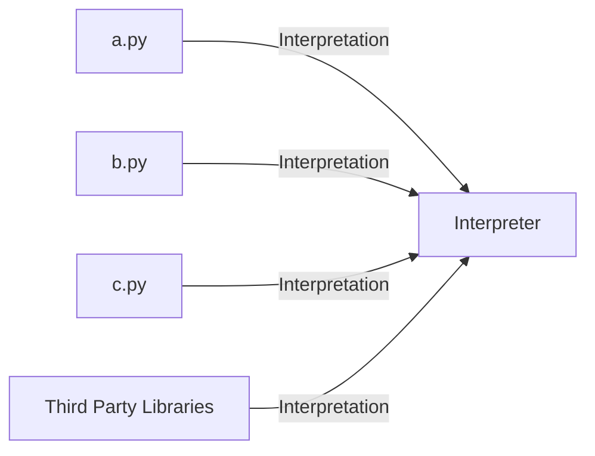
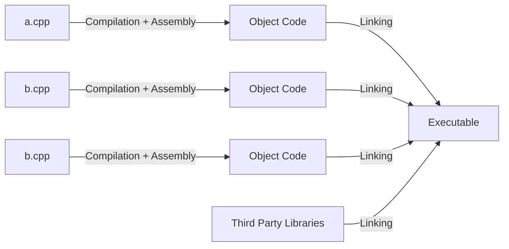
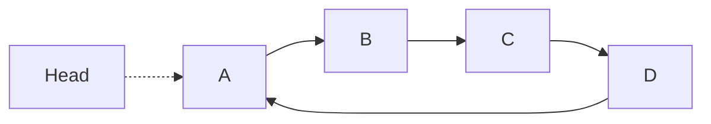
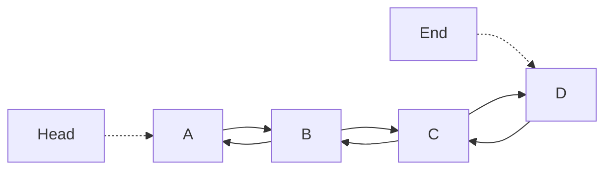

# Frequência I

- [Frequência I](#frequência-i)
- [1. Linguagens](#1-linguagens)
  - [1.1. Linguagem de Programação](#11-linguagem-de-programação)
  - [1.2. Processamento](#12-processamento)
  - [1.3. Sintaxe & Semântica](#13-sintaxe--semântica)
  - [1.4. Linguagens Interpretadas & Linguagens Compiladas](#14-linguagens-interpretadas--linguagens-compiladas)
    - [1.4.1. Linguagens Interpretadas](#141-linguagens-interpretadas)
    - [1.4.2. Linguagens Compiladas](#142-linguagens-compiladas)
      - [1.4.2.1. Criação de um executável](#1421-criação-de-um-executável)
    - [1.4.2. Linguagens Interpretadas vs. Linguagens Compiladas](#142-linguagens-interpretadas-vs-linguagens-compiladas)
  - [1.5. C++](#15-c)
    - [1.5.1. Identificadores](#151-identificadores)
        - [1.5.1.1. Carateres](#1511-carateres)
        - [1.5.1.2. Enums](#1512-enums)
    - [1.5.2. Declaração de Variáveis](#152-declaração-de-variáveis)
    - [1.5.3. _Casting_](#153-casting)
    - [1.5.4. Incrementação e Decrementação](#154-incrementação-e-decrementação)
    - [1.6. Controlo de Execução](#16-controlo-de-execução)
      - [1.6.1. _Switch_](#161-switch)
    - [1.7. Funções](#17-funções)
      - [1.7.1. Passagem de argumentos](#171-passagem-de-argumentos)
        - [1.7.1.1. Por valor](#1711-por-valor)
        - [1.7.1.1. Por referência](#1711-por-referência)
  - [1.7. Vetores (_Arrays_)](#17-vetores-arrays)
  - [1.8. _Pointers_ e endereços](#18-pointers-e-endereços)
    - [1.8.1. Declaração](#181-declaração)
    - [1.8.2. Alocação](#182-alocação)
      - [1.8.2.1. Estática](#1821-estática)
      - [1.8.2.1. Dinâmica](#1821-dinâmica)
  - [1.9. Strings](#19-strings)
  - [1.10. _Structs_](#110-structs)
  - [1.11. Linked Lists](#111-linked-lists)
    - [1.11.1. Arrays vs. Linked Lists](#1111-arrays-vs-linked-lists)
      - [1.11.1.1 Arrays](#11111-arrays)
      - [1.11.1.2. Linked Lists](#11112-linked-lists)
  - [1.11.2. Circular Linked List](#1112-circular-linked-list)
  - [1.11.2. Doubly Linked List](#1112-doubly-linked-list)
  - [1.12. Stacks](#112-stacks)
    - [1.12.1. Operações](#1121-operações)
  - [1.12. Queues](#112-queues)
    - [1.12.1. Operações](#1121-operações-1)
- [2. Tipos de Dados Abstratos](#2-tipos-de-dados-abstratos)
  - [2.1. Metodologia](#21-metodologia)
    - [2.1.1. Especificação](#211-especificação)
    - [2.1.2. Operações](#212-operações)
    - [2.1.3. Axiomas — Especificação](#213-axiomas--especificação)
  - [2.2. Enriquecimento de uma especificação](#22-enriquecimento-de-uma-especificação)
  - [2.3. Exemplos](#23-exemplos)
- [3. Ficheiros](#3-ficheiros)
  - [3.1. Biblioteca `fstream`](#31-biblioteca-fstream)

# 1. Linguagens
## 1.1. Linguagem de Programação

$Definição.$ Linguagem sistemática que permite descrever uma sequência de instruções que o computador pode executar.

**Linguagem de máquina:** instruções elementares que dependem do processador (e.g. x86-64 Assembly).
**Linguagem de alto nível:** instruções complexas e independentes do processador (e.g. C++).

## 1.2. Processamento


## 1.3. Sintaxe & Semântica
**Sintaxe**: estrutura ou a gramática da língua. No fundo, são regras que definem se a frase (código) foi construída de maneira adequada ou não.

**Semântica**: significado das frases (código) escrito. No fundo, verifica se a frase escrita é válida e, em caso afirmativo, o seu significado.

## 1.4. Linguagens Interpretadas & Linguagens Compiladas
### 1.4.1. Linguagens Interpretadas

Linguagem em que as instruções não são executadas diretamente pela máquina de destino, mas sim lidas e executadas por algum outro programa (**interpretador**).



### 1.4.2. Linguagens Compiladas

Linguagem em que o programa, uma vez compilado, é expresso nas instruções da máquina de destino; este código de máquina é indecifrável por humanos.

#### 1.4.2.1. Criação de um executável
Passa pelas 3 fazes referidas em [Processamento](#12-processamento).

1. **Compilação**
    - verifica se o código fonte está corretamente escrito (i.e. verifica a sintaxe);
    - realiza a tradução de linguagem de alto nível para linguagem máquina;
    - compiladores diferentes para arquiteturas de processadores diferentes.
2. **_Assembly_** 
    - transforma as instruções em _object code_ (_binário_);
    - resulta nas instruções que o processador pode processar.
3. **_Linking_**
    - re-organiza o _object code_ de forma a que a máquina possa eexecutar o mesmo;
      - pode adicionar funções/bibliotecas externas.
    - resulta num ficheiro executável (e.g. `.exe` no Windows).



### 1.4.2. Linguagens Interpretadas vs. Linguagens Compiladas
| Compilada   | Interpretada   |
| -------------- | -------------- |
| Existem passos entre o código fonte e a execução (compilação + linking + assembly)     | Apenas um passo (a interpretação)     |
| Os programas correm mais rapidamente    | Os programas tendem a ser mais lentos     |
| Erros de compilação previnem que o programa seja compilado (e, assim, executado)     | Erros de compilação tornam-se em erros de runtime     |

## 1.5. C++
1. Todos os programas têm uma função `main`
   - é a primeira a ser executada;
   - tem de retornar um valor `int`;
   - pode ter argumentos, e.g. `int main(int argc, const char* argv[])`.
   - linguagem **fortemente tipificada**, pelo que o tipo dos argumentos e do retorno têm de ser definidos.

### 1.5.1. Identificadores
- sequências de letras ou dígitos;
- `_` para separar palavras, e.g. `student_num`;
- variáveis em letras mínusculas (e.g. `int truthy_value = true;`) e constantes em maísculas (e.g. `const int MAX_STUDENTS = 500;`)

##### 1.5.1.1. Carateres
- variáveis com o tipo `char`
- são números inteiros (e.g. '0' representa 48 na tabela ASCII);
- uma `string` é representada, internamente, como um array de `chars`:

$$
\begin{bmatrix}
    'P', & 'a', & 'l', & 'a', & 'v', & 'r', & 'a', & '\char`\\0' \\
\end{bmatrix}
$$

##### 1.5.1.2. Enums
- definido por sequência de constantes;
- cada constante tem valor `int` a partir de `0`:

```cpp
enum Days {
    SUNDAY, // 0
    MONDAY, // 1
    // ...
}
```

- o valor de cada constante pode ser especificado:

```cpp
enum Food {
    APPLE, // 0,
    BANANA = 5, // 5
    PEAR, // 6
    PINEAPPLE = 100, // 100
    ORANGE = 200, // 200,
    PEACH, // 201
    // ...
}

Food get() {
    return APPLE; // returns 0
}
```

### 1.5.2. Declaração de Variáveis
- sequencialmente:

```cpp
int a, b, c;
char c, line[1000];
```

- alternative, é possível declarar em separado:

```cpp
int a;
int b;
int c;
char c;
char line[1000];
```

- aquando de uma declaração, esta é colocada numa posição de memória:

```cpp
// 4 bytes are allocated in memory to represent `a`
int a = 100;
```

- a variável $a$ é identificada por um endereço de memória e é esse endereço que é usado internamente para aceder ao valor da variável.
- _bytes_ referentes à mesma variável são guardados sequencialmente;
- o endereço de memória é um valor hexadecimal
  - arquitetura de $n$ bites endereça até $2^n$ posições de memória.
    - $n$ é também o número máximo de bits que podem ser processados a cada ciclo ($word$).
    - e.g. Windows 64-bit $\mapsto$ $2^{64}$ posições de memória endereçáveis.

- as variáveis constantes não podem mudar de valor:

$$
\begin{aligned}    
    &\texttt{\#define NAME value} \\
    &\texttt{const <type> <name> = <value>;} \\
\end{aligned}
$$

```cpp
#define Euler 2.718281
const double pi = 3.14;
const char t[] = "Welcome to C++!";
```

- a _keyword_ `static` mantém o valor da variável entre chamadas à função:

```cpp
int procedure() {
    static int i = 0;
    return i++;
}

int main() {
    printf("%d", procedure()); // 0
    printf("%d", procedure()); // 1
    printf("%d", procedure()); // 2
    return 1;
}
```

### 1.5.3. _Casting_
- permite a conversão entre tipos;
- quando o argumento não é `unsigned`:
  - se algum argumento é `long double`, converte para `long double`;
  - se algum argumento é `double`, converte para `double`;
  - se algum argumento é `float`, converte para `float`;
  - caso contrário, converte `char` e `short` para int;

$$
\text{(<novo tipo>(expressão))}
$$

```cpp
int i = (int)2.34; // 2
```

- $float \to int$ resulta na perca das casas decimais.

### 1.5.4. Incrementação e Decrementação
- incrementação: `++`;
- decrementação: `--`;
- Operador prefixo:
  - incrementação e depois retorno: `++var`;
  - decrementação e depois retorno: `--var`.
- Operador sufico:
  - retorno e depois incrementação: `var++`;
  - retorno e depois decrementação: `var--`;

### 1.6. Controlo de Execução

#### 1.6.1. _Switch_ 
- decisão com múltiplas opções;
- verifica se a expressão assume um valor de um conjunto de valores inteiros constantes;

```cpp
switch (/*<expression>*/) {
    case /*<constant expression>*/:
        /*<instructions>*/
        break;
    case /*<constant expression>*/:
        /*<instructions>*/
        break;
    default:
        /*<instructions>*/
        break;
    
}
```

### 1.7. Funções
$$
\text{<return> <name> (<arguments>) \{ \\

<body> \\
<instructions> \\
<return> \\

\}}
$$

#### 1.7.1. Passagem de argumentos
##### 1.7.1.1. Por valor

- função recebe uma cópia da variável que é fornecida;
- todas as alterações feitas dentro da função não alteram o valor original;

```cpp
void some_procedure(int n) {
    n = 50;
    printf("n in function: %d\n", n); // 50
}

int main()
{
    int a = 5;
    some_procedure(a);
    printf("n outside function: %d\n", a); // 5
    return 0;
}
```

##### 1.7.1.1. Por referência
- função recebe uma referência às variáveis utilizadas;
- todas as alterações feitas dentro da função alteram o valor original;

```cpp
void some_procedure(int *n) {
    n = 50;
    printf("n in function: %d\n", n); // 50
}

int main()
{
    int a = 5;
    some_procedure(&a);
    printf("n outside function: %d\n", a); // 50
    return 0;
}
```

## 1.7. Vetores (_Arrays_)
- estrutura de dados que permite o armazenamento de dados de uma forma sequencial;

$$
\texttt{<type> name[<size: integer>];}
$$

```cpp
int i[100]; // array de 100 `int`s
float f[100]; // array de 100 `float`s
char* c[100]; // array de 100 `char`s
```

- inicialização em linha:

```cpp
int n[5] = { 1, 2, 3, 4, 5 };
int m[] = { 1, 2, 3, 4, 5 };
char s[] = "my string";
char s[] = { 'm', 'y', ' ', 's', 't', 'r', 'i', 'n', 'g' };
```

- vetores bidimensionais:

$$
\texttt{<type> name[<row: integer>][<column: integer>];}
$$


```cpp
int v[5][5];
```
$$
v=\begin{bmatrix}
  0 & 0 & 0 & 0 & 0 \\  
  0 & 0 & 0 & 0 & 0 \\
  0 & 0 & 0 & 0 & 0 \\
  0 & 0 & 0 & 0 & 0 \\
  0 & 0 & 0 & 0 & 0 \\
\end{bmatrix}
$$

## 1.8. _Pointers_ e endereços

### 1.8.1. Declaração

$$
\texttt{<type> *<name>;}
$$

```cpp
char *c;
int *i;
double *d;
```

- `int a = 1`; `&a` $\to$ endereço de `a`;
- `int *b = &a`; `*b` $\to$ conteúdo da posição apontada por `b`;
- a prioridade de `&` e `*` é superior à dos operadores aritméticos:
  - `y = *x + 1` soma 1 ao valor apontado por `x`;
  - `++*x` incrementa o valor da variável apontada por `x`;
- o operador `sizeof` retorna o tamanho da variável passada:

```cpp
int v[] = {1, 2, 3};
printf("%d", sizeof(v)); // 3 * (4 bytes) = 12
```

- um apontador para um array é um apontador para a primeira posição do array:

```cpp
int v[] = {1, 2, 3};
int *a = v;
printf("v[0] = %d\n", v[0]);
printf("v[0] = %d\n", *(a));
```

- `char t1[] = "ola"` e `char *t2  = "ola"`
  - ambas alocam 4 bytes;
  - é possível modificar o conteúdo da memória alocada;
  - **não é possível alterar o valor de** `t1` (i.e. apontar para outra posição de memória);
  - **é possível altera o valor de** `t2`.

### 1.8.2. Alocação
#### 1.8.2.1. Estática
- memória alocada durante o scope da variável;
- não é possivel libertar quando não é necessária;
- não é possível utilizar fora do scope;

#### 1.8.2.1. Dinâmica
- alocação de um único elemento:
$$
\texttt{<type> *<name> = new <type>;}
$$

```cpp
int *p = new int;
int *q = new int(1); // inicializar com o valor 4
```

- alocação de vários elementos (_array_):

$$
\texttt{<type> *<name> = new <type>[size: integer];}
$$

```cpp
int *v = new int[5];
```

$$
v=\begin{bmatrix}
  \texttt{nullptr} & \texttt{nullptr} & \texttt{nullptr} & \texttt{nullptr} & \texttt{nullptr}
\end{bmatrix}
$$

- para libertar a memória, usa-se o operador `delete`:

```cpp
int *p = new int;
int *v = new int[5];

// ...

delete p;
delete[] v; // em caso de arrays
```

## 1.9. Strings
- necessário a inclusão da biblioteca `string`: `#include <string>`;
- classe desenhada para operar com sequências de carateres;
- acesso a carateres: operador `[]`;
- capacidade: `size`, `length`, etc;
- operações comuns: `find`, `compare`, `find_first_of`, etc;


$$
\text{Sintaxe: }\texttt{<string>.<method>(...arguments)}
$$

## 1.10. _Structs_
- permitem definir estruturas de dados sofisticadas;
- possibilitam a agregação de diferentes tipos de declarações;

$$
\texttt{<type> <name>;}
$$

$$
\texttt{<type> <name> = { <values> };}
$$


```cpp
struct Point {
    int x;
    int y;
}

Point p;
p.x = 20;
p.y = 10;

Point *q = new Point;
q->x = 20;
q->y = 10;

delete q;
```

## 1.11. Linked Lists
- cada elemento da _linked list_ é um `node`;

```cpp
struct Node {
    int data;
    Node *next;
}


int main() {
    // Linked List com 2 nodes
    Node* head = new Node;
    Node* second = new Node;
    head->data = 0;
    head->next = second;
    second->data = 1;
    second->next = nullptr;

    int len = length(head);

    return 1;
}

int length(Node *head) {
    Node* current = head;
    int count = 0;
    while (current->next != nullptr) {
        count++;
        current = current->next;
    }
    return count;
}

Node* insertBeginning(Node *head, int data) {
    Node* newHead = new Node;
    newHead->data = data;
    newHead->next = head;
    head = newHead;
    return head;
}

Node* insertEnd(Node *head, int data) {
    if (head == nullptr) {
        insertBeginning(data);
    }

    Node* newNode = new Node;
    newNode->data = data;
    
    Node* it = head;
    while(it->next != nullptr) {
        it = it->next;
    }

    it->next = newNode;
    newNode->next = nullptr;
    return head;
}

Node* insertPosition(Node *head, int data, int index) {
    int len = length(head);
    if (index >= len) {
        return head;
    } else if (index == 0) {
        insertBeginning(head, data);
    } else if (index == len - 1) {
        return insertEnd(head, data);
    } else {
        Node* it = head;
        int count = 0;
        while(count < index && it->next != nullptr) {
            it = it->next;
            count++;
        }
        Node *newNode = new Node;
        newNode->value = data;
        newNode->next = it->next;
        it->next=newNode;
    }
}

Node* removeBeginning(Node *head) {
    if (head == nullptr) {
        return nullptr;
    } else {
        Node *aux = head;
        head = head->next;
        delete aux;
        return head;
    }
}

Node* removeEnd(Node *head) {
    if (head == nullptr) {
        return nullptr;
    } else if (head->next == nullptr) {
        return removeBeginning(head);
    } else {
        Node* it = head;
        while(it->next->next != nullptr) {
            it = it->next;
        }

        delete it->next;
        it->next = nullptr;
        return head;
    }
}

void print(Node *head) {
    Node *temp = head;
    while (temp != nullptr) {
        printf("%d\n", temp->data);
        temp = temp->next;
    }
}

```

### 1.11.1. Arrays vs. Linked Lists
#### 1.11.1.1 Arrays
- **Vantagens**:
  - permitem acesso direto a um dado índice;

- **Desvantagens**:
  - tamanho alocado em memória é fixo;
  - o custo de inserção é potencialmente elevado;

#### 1.11.1.2. Linked Lists 
- **Vantagens**:
  - alocam memória só para os elementos que necessitam;

- **Desvantagens**:
  - não é possível fazer acesso direto;

## 1.11.2. Circular Linked List
- o pointer seguinte do último elemento da lista aponta para o primeiro;




## 1.11.2. Doubly Linked List


```cpp
struct DLLNode {
    DLLNode *previous;
    DLLNode *next;
    int data;
}
```

## 1.12. Stacks
- lista com operações especiais de acesso;
- o acesso aos elementos da _stack_ é feito sempre pelo topo (FIFO);

### 1.12.1. Operações
- `empty`: limpa a _stack_
- `create`: cria uma _stack_
- `pop`: retira um elemento do topo da _stack_
- `push`: coloca um elemento no topo _stack_
- `top`: aceder ao topo da _stack_ sem retirar o elemento


```cpp
struct Stack {
    struct Item {
        int data;
        Item* previous;
    };
    Item* top;
}

void put(Stack *p, int data) {
    Stack::Item *aux = new Stack::Item;
    aux->data = data;
    aux->previous = p->top;
    p.top = aux;
}

void remove(Stack *p) {
    if (empty(p)) throw EMPTY_STACK_ERROR;
    Stack::Item *aux = p->top;
    p.top = aux->previous;
    delete aux;
}

Stack::Item* pop(Stack *p) {
    if (empty(p)) throw EMPTY_STACK_ERROR;
    Stack::Item *aux = p->top;
    p.top = aux->previous;
    return aux;
}
```

## 1.12. Queues
- o acesso aos elementos é feito pela extremidade oposta à inserção (FIFO);

### 1.12.1. Operações
- `create`: cria uma _queue_
- `add`: adiciona um elemento no final da _queue_
- `remove`: remove um elemento do início da _queue_
- `show`: mostra o primeiro elemento

```cpp
struct Queue {
    struct Item {
        int data;
        Item* next;
    };
    Item *start;
}

void create(Queue *q) {
    q->top = nullptr;
}

void add(Queue *q, Queue::Item *item) {
    if (q->top == nullptr) {
        q->top = item;
        item->next = nullptr;
    } else {
        item->next = q->top;
        q->top = item;
    }
}

void remove(Queue *q){
    int len = length(f);
    if (len == 0) throw EMPTY_STACK_ERROR;

    if (len == 1){
        delete f.ap_inicio;
        q->top = NULL;
    } else if (len == 2) {
        delete q->top->next;
        q->top->next = NULL;
    } else {
        Queue::item *aux = q->top;
        while (q->next->next != nullptr){
            aux = aux->next;
        }

        delete aux->next->next;
        aux->next = NULL;
    }
}
```

# 2. Tipos de Dados Abstratos
- **Tipos de dados**, TD:
  - define o conjunto de valores que a variável pode assumir e o conjunto de operações que poderão ser efetuadas sobre esses valores;
- **Estruturas de dados**, ED: formas de organização da informação que proporcionam mecanismos de acesso e de manipulação convenientes e eficientes;

- **Tipos de dados abstratos**, TDA: permitem-nos construir programas que usam abstrações de mais alto nível e separar as operações efetuadas sobre os dados de quaisquer estruturas de dados ou implementações específicas.
  - acessíveis apenas através de uma _interface_;
    - o programa que usa um TDA chama-se um _client_ e o programa que define os tipos de dados uma _implementation_;
    - exemplo: ficheiro `.h` (_header_) com os protótipos das funções;
  - é preciso escolher uma ED para representar uma TDA:
    - constituída por tipos primitivos (`int`, `char`, etc) ou compostos (`arrays`, etc);
  - a **interface** serve de contrato entre o cliente e a implementação;
  - **especificação**: descrição completa do comportamento das funções, usando uma notação matemática formal;
  
## 2.1. Metodologia
1. Identificação dos TDA;
2. Especificação dos TDA;
3. Desenvolvimento do programa abstrato pretendido;
4. Implementação dos TDAs;
5. Reificação do programa escrito com base nas implementações escolhidas;

### 2.1.1. Especificação
A especificação de tipos de dados abstratos $E$ é um terno

$$
{E=<G, O, A>} \\

\normalsize G: \text{ conjunto de géneros (TD)} \quad O: \text{ conjunto de operações} \quad A: \text{ conjunto de axiomas}
$$

- o par $<G,O>$ é a **assinatura da especificação;
  
### 2.1.2. Operações
- uma operação $O$ de $E=<G,O,A>$ é um terno $<o,w,g>$ representado por

$$
o: w \to g \\
o: \text{ símbolo (nome ou identificador)} \quad w: \text{ domínio} \quad g: \text{ contradomínio}
$$

- **aridade**: comprimento do domínio de uma operação;
  - operações de aridade 0 dizem-se constantes
  - exemplos:

$$
\begin{aligned}
    &\texttt{verdadeiro e falso} &\text{Aridade 0} \\
    &\texttt{negação} &\text{operação unária} \\
    &\texttt{conjunção} &\text{operação binária} \\
\end{aligned}
$$

### 2.1.3. Axiomas — Especificação
- um axioma (fórmula) de $E=<G,O,A>$ é um quádruplo $<X,m,e,d>$ em que:
  - $X$: conjunto de variáveis;
  - $m$: classificação (a cada variável de $X$, é atribuído um género de $G$);
  - $e, d$: termos de um mesmo género $G$.
- descrevem a semântica das operações;
- são formados sobre a assinatura $<G,O>$ a partir das variáveis $X$ e com a sua classificação dada por $m$;

$$
\begin{aligned}
    &\texttt{especificação <name>}= \\
    &\qquad\texttt{importa <especificação>} \\
    &\qquad\texttt{gêneros} \\
    &\qquad\texttt{...} \\
    &\qquad\texttt{operações} \\
    &\qquad\qquad\texttt{construtoras} \\
    &\qquad\qquad\texttt{...} \\
    &\qquad\qquad\texttt{acessórias} \\
    &\qquad\qquad\texttt{...} \\
    &\qquad\texttt{axiomas} \\
    &\qquad\texttt{...} \\
    &\qquad\texttt{pré-condições} \\
    &\qquad\texttt{...} \\
    &\texttt{fim-especificação} \\
\end{aligned}
$$

- exemplo: especificação dos números naturais, `naturais`:

$$
\begin{aligned}
    &\texttt{especificação naturais}= \\
    &\qquad\texttt{gêneros} \\
    &\qquad\qquad\texttt{natural} \\
    &\qquad\texttt{operações} \\
    &\qquad\qquad\texttt{construtoras} \\
    &\qquad\qquad\qquad\texttt{zero: } \to \texttt{natural} \\
    &\qquad\qquad\qquad\texttt{sucessor: natural} \to \texttt{natural} \\
    &\qquad\qquad\texttt{acessórias} \\
    &\qquad\qquad\qquad\texttt{adição: natural natural} \to \texttt{natural} \\
    &\qquad\texttt{axiomas} \\
    &\qquad\qquad\ (\forall N, M \in \texttt{natural}) \\
    &\qquad\qquad\texttt{adição (zero, M) = M} \\
    &\qquad\qquad\texttt{adição (sucessor(N), M) = sucessor(adição(N,M))} \\
    &\texttt{fim-especificação} \\
\end{aligned}
$$

- exemplo: especificação dos `boolean`:

$$
\begin{aligned}
    &\texttt{especificação booleans}= \\
    &\qquad\texttt{gêneros} \\
    &\qquad\qquad\texttt{bool} \\
    &\qquad\texttt{operações} \\
    &\qquad\qquad\texttt{construtoras} \\
    &\qquad\qquad\qquad\texttt{true: } \to \texttt{bool} \\
    &\qquad\qquad\qquad\texttt{false: } \to \texttt{bool} \\
    &\qquad\qquad\texttt{acessórias} \\
     &\qquad\qquad\qquad\texttt{not: } \to \texttt{bool} \\
     &\qquad\qquad\qquad\texttt{and: bool bool } \to \texttt{bool} \\
    &\qquad\texttt{axiomas} \\
    &\qquad\qquad\ (\forall b \in \texttt{bool}) \\
    &\qquad\qquad\texttt{not(true) = false} \\
    &\qquad\qquad\texttt{not(false) = true} \\
    &\qquad\qquad\texttt{and(b, true) = b} \\
    &\qquad\qquad\texttt{and(b, false) = false} \\
    &\texttt{fim-especificação} \\
\end{aligned}
$$

## 2.2. Enriquecimento de uma especificação
- permite a construção gradual de uma especificação complexa, a partir de especificações mais simples:

$$
\begin{aligned}
    &\texttt{especificação booleans\_with\_or}= \\
    &\qquad\texttt{importa} \\
    &\qquad\qquad\texttt{booleans} \\
    &\qquad\texttt{operações} \\
    &\qquad\qquad\texttt{acessórias} \\
    &\qquad\qquad\qquad\texttt{or: } \to \texttt{bool} \\
    &\qquad\texttt{axiomas} \\
    &\qquad\qquad\ (\forall b, c \in \texttt{bool}) \\
    &\qquad\qquad\texttt{or(b, c) = not(and(not(b), not(c)))} \\
    &\texttt{fim-especificação} \\
\end{aligned}
$$

## 2.3. Exemplos
- especificação de uma `stack`

$$
\begin{aligned}
    &\texttt{especificação Stack<Element>}= \\
    &\qquad\texttt{importa} \\
    &\qquad\qquad\texttt{boolean $\oplus$ Element} \\
    &\qquad\texttt{gêneros} \\
    &\qquad\qquad\texttt{Stack} \\
    &\qquad\texttt{operações} \\
    &\qquad\qquad\texttt{construtoras} \\
    &\qquad\qquad\qquad\texttt{new: } \to \texttt{Stack} \\
    &\qquad\qquad\qquad\texttt{push: Stack Element} \to \texttt{Stack} \\
    &\qquad\qquad\texttt{acessórias} \\
    &\qquad\qquad\qquad\texttt{isEmpty: Stack } \to \texttt{bool} \\
    &\qquad\qquad\qquad\texttt{top: Stack} \to \texttt{Element} \\
    &\qquad\qquad\qquad\texttt{pop: Stack} \to \texttt{Stack} \\
    &\qquad\texttt{axiomas} \\
    &\qquad\qquad\ (\forall S \in Stack, I \in \texttt{Element}) \\
    &\qquad\qquad\texttt{isEmpty(new) = true} \\
    &\qquad\qquad\texttt{isEmpty(push(S, I)) = false} \\
    &\qquad\qquad\texttt{top(push(S, I)) = I} \\
    &\qquad\qquad\texttt{pop(push(S, I)) = S} \\
    &\qquad\texttt{pré-condições} \\
    &\qquad\qquad\texttt{top(S) e pop(S) requerem isEmpty(S) = false ou not(isEmpty(S))} \\
    &\texttt{fim-especificação} \\
\end{aligned}
$$

- especificação de uma `queue`

$$
\begin{aligned}
    &\texttt{especificação Queue<Element>}= \\
    &\qquad\texttt{importa} \\
    &\qquad\qquad\texttt{boolean $\oplus$ Element} \\
    &\qquad\texttt{gêneros} \\
    &\qquad\qquad\texttt{Queue} \\
    &\qquad\texttt{operações} \\
    &\qquad\qquad\texttt{construtoras} \\
    &\qquad\qquad\qquad\texttt{new: } \to \texttt{Queue} \\
    &\qquad\qquad\qquad\texttt{enqueue: Queue Element} \to \texttt{Queue} \\
    &\qquad\qquad\texttt{acessórias} \\
    &\qquad\qquad\qquad\texttt{isEmpty: Queue } \to \texttt{bool} \\
    &\qquad\qquad\qquad\texttt{front: Queue} \to \texttt{Element} \\
    &\qquad\qquad\qquad\texttt{dequeue: Queue} \to \texttt{Queue} \\
    &\qquad\texttt{axiomas} \\
    &\qquad\qquad\ (\forall Q \in Queue, I \in \texttt{Element}) \\
    &\qquad\qquad\texttt{isEmpty(new) = true} \\
    &\qquad\qquad\texttt{isEmpty(enqueue(Q, I)) = false} \\
    &\qquad\qquad\texttt{front(enqueue(Q, I)) = if isEmpty(Q) then I else front(Q)} \\
    &\qquad\qquad\texttt{dequeue(enqueue(Q, I)) = if isEmpty(Q) then new else enqueue(dequeue(Q), I)} \\
    &\qquad\texttt{pré-condições} \\
    &\qquad\qquad\texttt{top(S) e pop(S) requerem isEmpty(S) = false ou not(isEmpty(S))} \\
    &\texttt{fim-especificação} \\
\end{aligned}
$$

# 3. Ficheiros
- estendem a funcionalidade de uma aplicação:
  - guardar dados entre execuções;
  - interagir com outras aplicações.
- definidos por 2 aspetos importantes:
  - nome;
  - formato em que os dados estão organizados;
- só podem ser acedidos de forma sincronizada;
- garantir que os ficheiros são abertos e fechados corretamente;
- garantir acesso simultâneo a apenas um programa/função;

## 3.1. Biblioteca `fstream`
- retorna os dados em `std::string`
- exemplo de escrita:
```cpp
#include <fstream>

int main() {
    std::ofstream f("test.txt");
    f << "Olá Mundo!\n";
    f.close();
    return 0;
}
```
- exemplo de leitura:
```cpp
#include <fstream>
#include <string>

int main() {
    std::ifstream f("test.txt");
    std::string temp;
    if (!f.is_open()) return 1;
    while (std::getline(f,temp)) {
        printf("%s\n", temp); // Lê uma única linha
    }
    f.close();
    return 0;
}
```