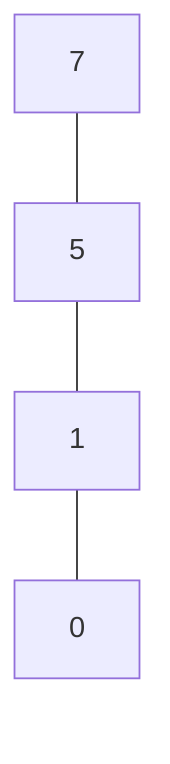

- [1. Relações](#1-relações)
  - [1.1. Relação n-ária. Estudo da relação binária.](#11-relação-n-ária-estudo-da-relação-binária)
  - [1.2. Relação reflexica, simétrica e transitiva. Relação de equivalência](#12-relação-reflexica-simétrica-e-transitiva-relação-de-equivalência)
  - [1.3. Partição de um conjunto. Classe de equivalência. Conjunto quociente.](#13-partição-de-um-conjunto-classe-de-equivalência-conjunto-quociente)
  - [1.4. Relações de ordem e conceitos associados](#14-relações-de-ordem-e-conceitos-associados)
  - [1.5 Conjuntos parcialmente ordenados](#15-conjuntos-parcialmente-ordenados)
    - [1.5.1 Diagramas de Hasse (c. p. o.)](#151-diagramas-de-hasse-c-p-o)

# 1. Relações
## 1.1. Relação n-ária. Estudo da relação binária.

$Definição.$ Uma relação **n-ária** ($n \gt 1$) $R$ é um qualquer conjunto de sequências de $n$ elementos.

Se $(x_1, x_2, ..., x_n) \in R$ diz-se que o tuplo $(x_1, x_2, ..., x_n)$ está em relação por $R$. $\{(1, 2),(3, 4, 5)\}$ não é uma relação pois é formada por tuplos de diferentes comprimentos.

$Notação.$ Seja $R$ uma relação binária; escreve-se $xRy$ em vez de $(x, y)\in R$.

$Definição.$ Seja $R$ uma relação binária.
- **Domínio**, $dom(R)=\{x:\exists_y xRy\}$
- **Contradomínio**, $cod(R)={y:\exists_x xRy}$
- **Inverso**, $R^{-1}=\{(y, x): (x,y) \in R\}$

1. Seja $R=\{(1,a),(2,b), (3,c)\}$. Calcular $dom(R), cod(R), R^{-1}, dom(R^{-1}), cod(R^{-1})$.

$$
dom(R)=\{1,2,3\} \\
cod(R)=\{a,b,c\} \\
R^{-1}=\{(a, 1), (b, 2), (c, 3)\} \\
dom(R^{-1})=\{a,b,c\} \\
cod(R^{-1})=\{1,2,3\} \\
$$

## 1.2. Relação reflexica, simétrica e transitiva. Relação de equivalência

$Definição.$ Seja $R$ uma relação binária em $A$ ($R \subseteq A^2$)
- $R$ é reflexiva se e só se $\forall_{x\in A}: (x,x)\in R$
- $R$ é **simétrica** se e só se $\forall_{x,y\in A}:(x,y)\in R \implies )(y, x) \in R$
- $R$ é **transitiva** se e só se $\forall_{x,y,z\in A:(x,y)\in R \wedge (y, z) \in R \implies (x, z) \in R}$
- $R$ é uma relação de equivalência se for, simultaneeamente, **reflexiva**, **simétrica** e **transitiva**.

## 1.3. Partição de um conjunto. Classe de equivalência. Conjunto quociente.

$Definição.$ Seja $A\neq \empty$. Uma **partição** de $A$ é um conjunto $\beta$ formado por subconjuntos de $A$ tal que:
- $\forall_{S \in \beta}: S \neq \empty$
- $\forall_{S_1, S_2}: (S_1\neq S_2 \implies S_1 \cap S_2 = \empty)$ $\to$ Os elementos de $\beta$ são disjuntos dois a dois.
- $\bigcup_{S\in \beta}S=\bigcup \beta=A$ (A união da coleção $\beta$ é o próprio A)

1. Seja $A=\{2,4,6,8\}$. Escreva as partições de $A$.

$$
\begin{aligned}
    1 \mapsto& \{ \{2\}, \{4\}, \{6\}, \{8\} \} \\
\ \\
2 \mapsto& \begin{array}{|c}
    \{\{2, 4\}, \{6, 8\}\} \\
    \{\{2, 6\}, \{4, 8\}\} \\
    \{\{2, 8\}, \{4, 6\}\} \\
    \{\{2\}, \{4, 6, 8\}\} \\
    \{\{4\}, \{2, 6, 8\}\} \\
    \{\{6\}, \{2, 4, 8\}\} \\
    \{\{8\}, \{2, 4, 6\}\} \\
\end{array} \\
3 \mapsto& \begin{array}{|c}
    \{\{2\}, \{4\}, \{6, 8\}\} \\
    \{\{2\}, \{6\}, \{4, 8\}\} \\
    \{\{2\}, \{7\}, \{6, 4\}\} \\
    \{\{4\}, \{6\}, \{2, 8\}\} \\
    \{\{4\}, \{8\}, \{2, 4\}\} \\
    \{\{6\}, \{8\}, \{2, 4\}\} \\
\end{array} \\
4 \mapsto& \{2,4,6,8\}
\end{aligned} \\
\ \\
\text{Existem 15 partições.}
$$

$Observação.$ As partições representam o número de Bell.

$$
\underbrace{1}_{B_0},
\underbrace{1}_{B_1},
\underbrace{2}_{B_2},
\underbrace{5}_{B_3},
\underbrace{15}_{B_4},
57,203,877,4140,21147,115975...
\\
\ \\
\begin{aligned}
    \text{Fórmula}: \begin{array}{|c}
       &B_0=B_1=1 \\
       &B_{n+1}=\sum^n_{k=0} \binom{n}{k}B_k
    \end{array}
\end{aligned}
$$

$Definição.$ Seja $R$ uma relação de equivalência em $A$ e seja $a \in A$. A **classe de equivalência** de $a$ designa-se por $[a]_R$,

$$
[a]_R=\{x\in A:xRa\}=\{x\in A:(x,a) \in R\}
$$

$Observação.$ Ao elemento $a$ utilizado em $[a]_R$ para designar a classe $\{x\in A:xRa\}$ chama-se representante da classe.

$Teorema.$ Seja $R$ uma relação de equivalência em $A$ e sejam $a, b \in A$.
- $a\in [a]_R$
- $aRb⇔[a]_R=[b]_R$ (ou $(a,b) \in R ⇔ [a]_R=[b]_R$)
- $a\cancel{R}b⇔[a]_R\cap[b]_R=\emptyset$

$Definição.$ Seja $R$ relação de equivalência em $A$. O **conjunto quociente** de $A$ é o conjunto $A/R=\{[x]: x\in A\}$.

$Teorema.$ Seja $R$ uma relação de equivalência em $A$, então $A/R$ é uma partição de $A$.

Sejam $A=\{0,y,3,w,5\}$ e $R=\begin{bmatrix}
    &(0,0),(y,y),(3,3),(w,w),(5,5),(0,y),\\&(y,0),(w,5),(5,w)
\end{bmatrix}$. Calcular $[y]_R$ e $A/R$.

$$
\begin{aligned}
    [0]_R&=[0]=\{a\in A: (a,0)\in R\}=(0, y) \\
    [y]_R&=\{a\in A: (a,y)\in R\}=(y, a) \\
    [3]_R&=\{a\in A: (a,3)\in R\}=(3) \\
    [w]_R&=\{a\in A: (a,w)\in R\}=(w,5) \\
    [5]_R&=\{a\in A: (a,5)\in R\}=(5,w) \\
\end{aligned}

\ \\
\ \\

\begin{aligned}
    A/R&=\{\underbrace{[0], [y]}_{=}, [3], \underbrace{[w], [5]}_{=}\} \\
    &=\{[0],[3],[w]\} \\
    &=\{\{0,y\},\{3\},\{w,5\}\}
\end{aligned}
$$

## 1.4. Relações de ordem e conceitos associados
$Definição.$ Seja $R$ uma relação binária em $A$.
- $x,y \in A$ dizem-se **comparáveis** por meio de $R$ se e só se $xRy \vee yRx$.
- $R$ é **irreflexiva** se e só se $\forall_{x \in a}: x\cancel{R}x$
- $R$ é **antissimétrica** se e só se $\forall_{x,y\in A}:((x,y)\in R \wedge (y,x) \in R \implies x = y)$
- $R$ é uma **relação de ordem parcial** em sentido lato se e só se $R$ é **reflexiva, antissimétrica** e **transitiva**.
- $R$ é uma **relação de ordem parcial** em sentido estrito se e só se $R$ é **irreflexiva** e **transitiva**.

1. Sejam $A=\{1,2,3,4\}$, $R_1=\{(1,1),(1,2),(2,1),(3,3),(4,4)\}$, $R_2=\{(1,1),(3,3),(4,4)\}$, $R_3=\{(1,2),(1,3),(2,3)\}$. Verificar se são relações de ordem parcial.

$$
R_1\text{ não é r.o.p. } (2,2)\notin \R \\
R_2\text{ não é r.o.p. } (2,2)\notin \R \\
R_3\text{ é r.o.p. no sentido estrito, é irreflexiva e transitiva.} 
$$

## 1.5 Conjuntos parcialmente ordenados
### 1.5.1 Diagramas de Hasse (c. p. o.)

Seja $(A, \leq)$ com $A=\{0,1,5,7\}$.

1. Escrever todos os pares de A que verifiquem a relação $\leq$

$$
\begin{matrix}
    (0,0)& (1,1)& (5,5)& (7,7)& \\
    (0,1)& (1,5)& (5,7)\\
    (0,5)& (1,7)& \\
    (0,7)&
\end{matrix}
$$

2. Num **c.p.o.**, sabemos que a relação é **reflexiva**, por isso podemos tirar os pares $(x,y)$ onde $x=y$

$$
\begin{matrix}
    (0,1)& (1,5)& (5,7)\\
    (0,5)& (1,7)& \\
    (0,7)&
\end{matrix}
$$

3. Num **c.p.o.**, a relação é **transitiva**, logo é possível tirar todos os pares tais que $(x,y)\in R \wedge (y,z) \in R \implies (x,z) \in R$

$$
\begin{matrix}
    (0,1)& (1,5)& (5,7)\\
\end{matrix}
$$

