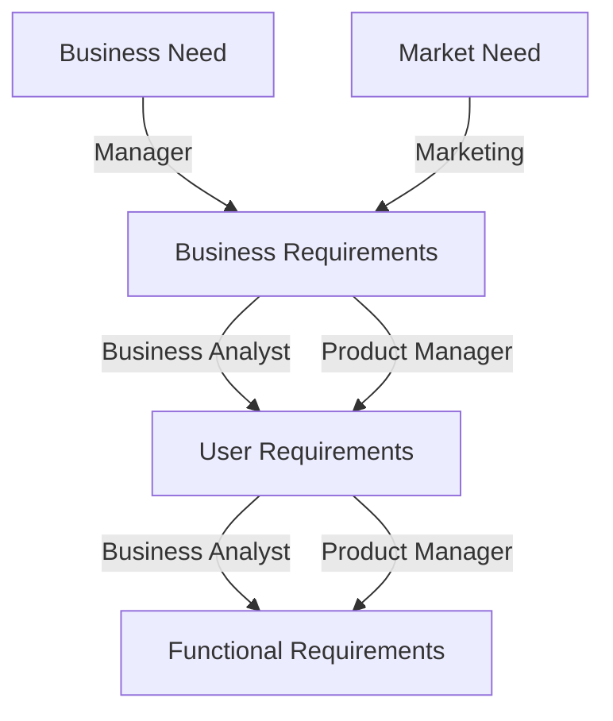

# Engenharia de Requisitos
> Tudo o que leva a uma escolha no design.
> Especificação do que deve ser implementado. Descrição de como o sistema se deve comportar, ou descrição de uma propriedade do mesmo.
- Cada software tem níveis distintos de requisitos, bem como uma série de requisitos não funcionais:
  1. Requisitos de negócio: representam o porquê de uma organização implementar um sistema;
  2. Requisitos de utilização: descrevem objetivos ou tarefas que devem ser possíveis de ser realizadas no sistema (representados como *use cases*, *user stories* ou *event-response tables*);
  3. Requisitos funcionais: descrevem o comportamento do sistema numa série de condições específicas (i.e. o que os engenheiros têm de implementar de forma a que os *uses cases* sejam possíveis, satisfazendo também os requisitos de negócio).
  4. Requisitos de sistema: descrevem requisitos de um *software* como um todo (e.g. descrevem funcionalidades de *sub-sistemas* e interligações entre os mesmos);
- As regras de negócio, apesar de não serem um requisito de software, limitam o âmbito de operação de um sistema e obrigam a certos comportamentos do mesmo (e.g. confidencialidade de dados);
- Os requisitos não funcionais afetam todo o sistema e ilustram como é que o sistema efetua certas operações e a sua interligação com sistemas externos;
- Uma feature é uma capacidade do sistema importante para um utilizador e é descrita num conjunto de requisitos funcionais;

- Os gestores ou responsáveis de marketing de uma empresa definem os requisitos de negócio de um sistema;
- Cada um dos requisitos de negócio vão de encontro a uma necessidade comercial;
- Os requisitos de utilização terão que permitir a concretização dos requisitos de negócio:
  - Destes são gerados requisitos (não) funcionais que implementam a funcionalidade.

## Produto vs. Projeto
- Os requisitos de produto estão relacionados com propriedades de um sistema;
- Os requisitos de projeto estão relacionados com o desenvolvimento do sistema (e.g. recursos físicos necessários, documentação, formação, processos para testes, aquisição de software, certificação);

# Desenvolvimento e Gestão de Requisitos

## Desenvolvimento

### Elicitação
- Todas as atividades durante a fase de descoberta dos requisitos;
- Identificação dos utilizadores do produto e respetivas tarefas/objetivos;
- Trabalhar com indivíduos que representam as classes de utilizador, compreendendo as suas necessidades e expectativas:
  - Esta abordagem foca-se em compreender as necessidades do utilizador e daí extrapolar novas funcionalidades para o sistema.
  
### Análise
- Análise da informação obtida dos utilizadores com vista a obter tarefas, objetivos, expectativas, regras de negócio e soluções;
- Decomposição de requisitos de alto nível em requisitos mais concretos, derivando requisitos funcionais de requisitos gerais;
- Alocar requisitos apra componentes e negociar prioridades de implementação;
- Identificação de requisitos em falta e eliminar requisitos desnecessários.

### Especificação
- Representar e guardar todo o conhecimento dos requisitos de forma persistente e organizada;
- Traduzir as necessidades dos utilizadores em requisitos e diagramas;

### Validação
- Confirmar que os requisitos são corretos, permitindo os engenheiros desenvolver uma solução de acordo com os objetivos de negócio;
- Revisão da documentação e desenvolvimento de critérios de teste e aceitação que os requisitos terão de passar para representarem corretamente as regras de negócio.