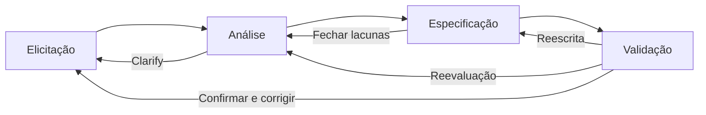

# Boas Práticas em ER

- **Elicitação:**
  - Definir a visão e âmbito do projeto:
    - Dá a todos os *stakeholders* um entendimento comum do resultado do produto;
    - Usado para avaliar novos requisitos.
  - Identificar classes de utilizadores e seus requisitos:
    - Descrever aspetos do seu trabalho, atitudes e caraterísticas que possam influenciar o design da solução.
  - Escolher o “representante do produto” para cada classe de utilizadores:
    - Escolher um indivíduo que serve como a voz do utilizador para cada classe de utilizador.
  - Desenvolver *focus groups* com utilizadores típicos:
    - Recolher a opinião de utilizadores relativamente a funcionalidade e qualidade do *software*.
  - Identificar requisitos do utilizadores com o(s) representante(s) do(s) utilizador(s):
    - Identificar a que eventos externos o sistema terá de responder.
  - Realizar entrevistas de elicitação:
    - Discutir o específico e apenas os requisitos que são importantes para cada grupo.
  - Organizar *workshops* de elicitação:
    - Permite que os analistas percebem as necessidades dos clientes/utilizadores.
  - Observar os utilizador nas suas tarefas:
    - Cria contextos para a utilização do sistema.
  - Distribuir questionários:
    - Chegam a um grupo vasto e disperso de utilizadores.
  - Executar análise documental:
    - O cliente poderá ter documentos que descrevam o sistema atual;
    - Podem ser especificações de requisitos, análise da concorrência ou descrição do processo de negócio;
  - Examinar *error-reports* do sistema atual:
    - Revelam capacidades que fazem sentido ser corrigidas.
  - Reutilizar requisitos:
    - Algumas funcionaliades podem ser correspondidas por um sistema existente, porém o cliente terá de os aceitar.
  - ### **Refinar os requisitos de forma a que os *stakeholders* os compreendam;**
  - ### **Procurar por erros, omissões e defeitos;**
  - ### **Decompor requisitos de alto nível para um nível de detalhe apropriado;**
  - ### **Construir protótipos.**
- **Análise:**
  - Modelar o ambiente da aplicação:
    - Elaborar um diagrama contextual que mostra como o sistema fará parte do ambiente empresarial.
  - Criar protótipos:
    - Ajuda a tornar os conceitos e possibilidades mais tangíveis.
  - Analisar a viabilidade:
    - Permite verificar se cada requisito é viável dentro do orçamento e agenda.
  - Prioritizar e modelar requisitos:
    - Perceber quais têm de ser implementados primeiro;
    - Utilizar diagramas que representem os requisitos de uma forma visual.
  - Analisar as interfaces entre o sistema e o mundo exterior:
    - Garante que o sistema "encaixa" no ambiente.
  - Alocar requisitos para os subsistemas:
    - Requisitos para sub-sistemas (em produtos complexos) terão de ser identificados.
- **Especificação:** ato de documentar os requisitos (de negócio, de utilizador e (não-)funcionais) de forma **consistente**, **compreensíva** e de fácil **revisão**
  - Adotar um *template* de documentação:
    - Obriga a pensar os requisitos da mesma forma.
  - Identificar origens dos requisitos:
    - Garante que todos os *stakeholders* sabem porque cada requisito é necessário;
    - Importante perceber quais *stakeholders* são afetados por quais requisitos.
  - Identificar cada requisito:
    - Através de um *label* único para cada um, adotando uma convenção robusta que permita adicionar novos requisitos.
  - Anotar regras de negócio:
    - Tais como políticas corporativas, regulações governamentais, padrões e/ou algoritmos;
    - Normalmente têm um ambito maior do que o do projeto a desenvolver.
  - Especificar requisitos não funcionais:
    - Os requisitos não funcionais de qualidade devem ser especificados da mesma forma que os requisitos funcionais elicitados.
- **Validação:** garantir que os requisitos estão corretos, que expressam a qualidade desejada e que satisfazem as necessidades do cliente.
  - Rever e testar requisitos:
    - Revisão minuciosa a pares dos requisitos implementados;
    - Testar os requisitos através da elaboração de testes que verificam se a implementação foi a mais correta.
  - Definir critérios de aceitação:
    - Perguntar aos utilizadores o que irá determinar se a solução cumpre os objetivos.
  - Simular os requisitos:
    - Simular que o sistema já está completo, permitindo os utilizadores interagir com o mesmo;
    - Permite que os requisitos pareçam implementados antes de estarem implementados em código.
- **Gestão de requisitos**: após a reunião dos requisitos inicias, surgem mudanças (sugeridas por clientes, gestores, *marketing*) o que leva à necessidade de um processo para propor, avaliar custo e impacto no projeto de cada novo requisito.
  - Estabelecer um processo para controle das mudanças nos requisitos:
    - O projeto deverá ter um processo para gerir como as mudanças são propostas, analisadas e resolvidas.
  - Realizar análise de impacto:
    - Ajuda os *stakeholders* a tomar decisões de negócio informadas;
    - Ajuda a perceber o impacto no projeto.
  - Criar um conjunto de requisitos baseline e controlar as mudanças nos conjuntos de requisitos:
    - Requisitos acordados entre todos para uma entrega ou iteração do sistema.
  - Manter um *changelog*:
    - Poderá ser necessário voltar a uma versão anterior de um requisito, ou perceber como um requisito chegou ao seu estado atual.
  - Acompanhar o estado dos requisitos:
    - Guardar um registo para cada requisito com o seu estado (e.g. proposto, aprovado, implementado, aprovado).
  - Acompanhar problemas com os requisitos:
    - Evitar que os problemas sejam esquecidos ou desapareçam.
  - Manter uma matriz de rastreio:
    -  Permite verificar que todos os requisitos estão implementados e podem ser testados.
  - Utilizar uma ferramenta de gestão de requisitos:
    - Automatizxam tarefas de gestão descritas.
- **Conhecimento**:
  - Treinar analistas de negócio:
    - Todos os membros da equipa que irão analisar o negócio do cliente deverão receber formação em E.R.
  - Educar *stakeholders* sobre requisitos:
    - Principalmente os que participam no *desenvolvimento*;
    - Devem perceber a terminologia, práticas e conceitos base.
  - Definir o processo de ER:
    - Documentar as etapas internas para eliciar, analisar, especificar, validar e gerir os requisitos.
  - Criar um glossário:
    - Define termos específicos para o domínio da aplicação.
- **Gestão de projeto:**
  - Selecionar um ciclo de desenvolvimento adequado:
  - Delinear a maneira de abordar requisitos:
    - Definir abordagem para especificar como os requisitos são desenvolvidos.
  - Definir esforços para os requisitos:
    - Planear o projeto e a agenda para o projeto de uma forma iterativa, conforme os requisito se tornam claros.
  - Identificar *decision-makers*:
    - Essencial identificar e capacitar pessoas o mais cedo possível no projeto.
  - Renegociar compromissos no projeto:
    - Avaliar se os novos requisitos podem alterar a capacidade de implementar o sistema.
  - Gerir riscos dos requisitos:
    - Identificar e documentar os riscos nos requisitos;
    - Explorar abordagens para prevenir os riscos;
  - Medir o esforço nos requisitos:
    - Facilita a estimativa dos recursos necessário para as tarefas de E.R.

## O Processo de ER

- A passagem entre fases não é sequencial pois é necessário validar requisitos existentes e requisitos, bem como suprimir lacunas;
- **Não existe um formula ou abordagem para o desenvolvimento de requisitos;**
- Processo geral para desenvolver requisitos:
  1. Definir requisitos de negócio;
  2. Identificar classes de utilizadores;
  3. Identificar representadores dos utilizadores;
  4. Identificar quem toma decisões sobre os requisitos;
  5. Planear elicitação;
  6. Identificar requisitos dos utilizadores;
  7. Prioritizar requisitos dos utilizadores;
  8. Desenvolver requisitos de utilizador;
  9. Derivar requisitos funcionais;
  10. Modelar os requisitos;
  11. Especificar requisitos não funcionais;
  12. Rever requisitos;
  13. Desenvolver protótipos;
  14. Desenvolver ou evoluir a arquitetura de *software*;
  15. Alocar requisitos a componentes;
  16. Desenvolver testes a partir dos requisitos;
  17. Validar requisitos de utilizador, funcionais, não funcionais, bem como modelos de análise e protótipos.
- Os passos 7 são desenvolvidos numa fase inicial;
- Os restantes passoss não efetuados durante o ciclo de desenvolvimento e efetuados iterativamente;
- O processo de E.R. está dependente do modelo de desenvolvimento escolhido:
  - **Cascade**:
    - Este modelo sugere uma abordagem sequencial e sistemática para o desenvolvimento de software:
      1. Levantamento de requisitos de utilizador;
      2. Planeamento e deliniação de estimativas de esforço e tempo;
      3. Modelação, onde ocorre a análise e projeção;
      4. Desenvolvimento, onde é construído o código;
      5. Implementação, onde o *software* é entregue e é recebido *feedback* e prestado suporte.
    - **Neste modelo, a maior parte do esforço de E.R. é efetuado no início do projeto.**
  - **Rational Unified Process:**
    - Modelo de desenvolvimento de *software* iterativo que consiste em 4 fases que permitem que o procesos seja apresentado, em alto nível, de maneira semelhante a um projeto em "Cascade", embora a chave deste processo esteja nas iterações de desenvolvimento em todas as fases;
  - **Agile:**
    - Inclui a descoberta de requisitos e melhoria de soluções através de um esforço colaborativo de equipas organizadas e *cross-functional*.
    - Desenvolvimento de requisitos mais frequente mas menos requisitos.
- **Independentemente do ciclo escolhido, devemos escolher a opção que adiciona valor e reduz o risco!**

