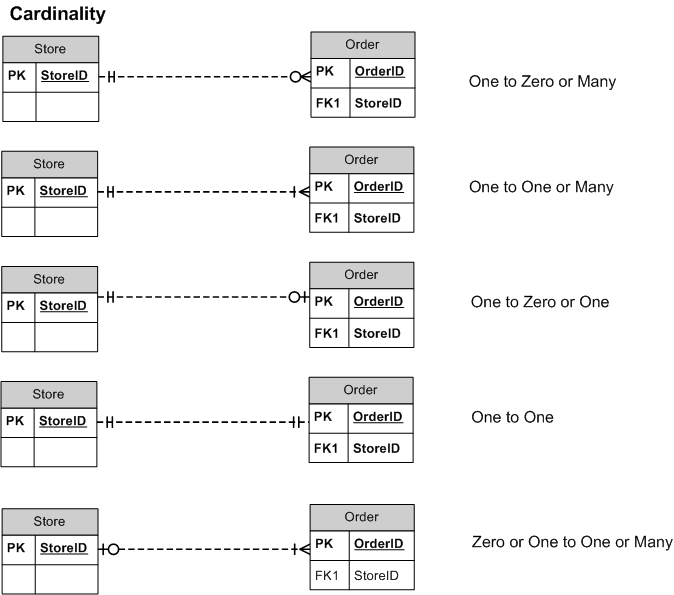

# T01: Modelo Entidade-Relação

## 1. Design

Caraterísticas de um **bom** *design* de uma base de dados:

- Explora aspetos em comum;
- Permite flexibilidade futura.

Caraterísticas de um **mau** *design* de uma base de dados:

- Redundante;
- Incompleto;

---

## 2. Modelação

É possível modelar uma base de dados como uma coleção de entidades e as relações entre essas mesmas entidades.

- **Entidade**: objeto (físico ou não) que contem um conjunto de atributos;
- **Instância de Entidade**: uma ocorrência particular de uma **Entidade**.

Na tabela abaixo, apresenta-se a estrutura da entidade $costumer$ e $loan$. Cada uma das linhas constituí uma **instância da entidade.**

[   ](https://www.notion.so/00a7be2b1fa849c58db9a9b64a441552)

[Untitled](https://www.notion.so/6a5ba02a07d74e908044dfb7a6f97747)

Uma entidade é representada por um conjunto de atributos, e.g.:

```bash
customer = (customer_id, customer_name, customer_street, customer_city)
```

```bash
loan = (loan_number, amount)
```

**Domínio**: conjunto de valores permitidos para cada atributo.

**Tipos de atributos**:

- *Simples* e *compostos*:
    - exemplo de atributo composto: `endereço`
        - um *`endereço`* pode ter rua, número de porta, código postal, etc.
- *Uni-valor* e *multi-valor*:
    - exemplo de atributo multi-valor: *`numeros_de_telemovel`.*
- Derivados (computados a partir de outros atributos):
    - exemplo de atributo derivado: `idade`, a partir de *`data_de_nascimento`.*

---

### 3. Conjuntos de Associações

**Relação**: associação entre várias entidades.

**Conjunto de associações**: relação matemática entre $n \geq 2$ entidades que permite associar as várias entidades.

Uma associação pode também ser uma propridade de uma relação.

**Aridade de uma associação**:

- Refere-se ao # de entidades que participam numa associação;
- A grande maioria das associações envolvem duas entidades, daí serem **binárias**;

**Mapeamento das restrições de cardinalidade**:

- Refere-se ao # de instância à qual outra instância pode estar associada através de uma associação;
- Útil a descrever relações binárias;
- Para uma associação binária, o mapeamento de cardinalidade tem de ser um dos seguintes:
    - Um para um (*one to one*);
    - Um para muitos (*one to many*);
    - Muitos para um (*many to one*);
    - Muitos para muitos (*many to many*).



Cardinalidade em Bases de Dados.

---

### 4. Chaves de Entidades

**Super Chave**: conjunto de um ou mais atributos cujos valores determinam univocamente cada entidade.

**Chave Candidata**: é uma *super chave* mínima (i.e. não há subconjuntos que tenham ainda chaves candidatas):

- `customer_id` é uma chave candidata de `customer`;
- `candidate_key` é uma chave candidata de `account`;

Apesar de poderem existir várias chaves candidatas, uma delas é escolhida como a **chave primária**.

**Cuidados na seleção de chaves primárias**:

- Identificadores únicos num ambiente restrito;
- Atributos que possam mudar.

---

### 5. Chaves de Associações

- A combinação de chaves primárias das entidades que participam na associação formam a super chave de uma associação:

`(customer_id,account_number)` é a super chave de `depositor`.

É necessário considerar a **cardinalidade** da associação aquando da decisão das chaves candidatas.

(Faltou explicação do último ponto)

---

### 6. Diagramas Entidade-Relação (E-R)

- Retângulos representam entidades;
- Diamantes representam associações.
- Linhas ligam atributos a entidades e entidades a associações.
- Elipses representam atributos:
    - Elipses duplas: atributos multi-valorados;
    - Elipses tracejadas: atributos derivados.
- Sublinhado representa a chave primária.

---

### 7. Papeis

- As entidades que participam numa associação não precisam de ser distintas.
- Os papeis (*roles*) são indicados em diagramas E-R ao legendar as linhas que conectam os diamantes aos retângulos.
- Os *roles* são opcionais e são utilizados para clarificar a semântica da associação.

---

### 8. Restrições de Cardinalidade

- Uma $\rightarrow$ significa "um";
- Uma $-$(seta sem direção) significa "muitos" (incluíndo 0);
- Relações *one-to-one*:

---

### 9. Participação de uma Entidade numa Associação

- **Participação total**:
    - representa-se por uma linha dupla;
    - toda a instância de uma entidade participada em, pelo menos, uma instância da associação.
- **Participação parcial**:
    - representa-se por uma única linha;
    - algumas instâncias da entidade podem não participar em qualquer instância da associação.

---

### 10. Aspetos de Desenho

- **Entidades vs. Atributos**
    - Depende do domínio e operações necessárias;
    - Em diagramas E-R:
        - Não utilizar PK de uma entidade como um atributo de outra entidade
            - **Questão**: uma FK que referencie a PK de outra entidade não é um atributo?
        - Não incluir as PK nas entidades participantes nas relações numa associação.
- **Entidade vs Associação**
- **Colocação de atributos nas relações**
    - Na entidade "many" numa associação:
        - *One to many*;
        - *Many to one.*
    - Em qualquer das entidades da associação:
        - *One to one.,*
    - Na associação:
        - *Many to many.*

---

### 11. Extensão de Diagramas E-R

- **Especialização:**
    - Semelhante à "herença";
    - Representa-se por um triângulo com o texto "ISA" (*is a*);
    - **Herança de Atributos**: uma entidade num nível mais baixo herda todos os atributos e participa nas associações da entidade no nível mais alto à qual está ligada.
- **Generalização**:
    - O contrário da **Especialização**;
    - Combinar entidades que partilham os mesmos atributos numa entidade num nível mais alto;

---

### 12. Concluíndo


Símbolos usados em diagramas E-R.

**Decisões de Design**:

- Utilização de um atributo ou entidade para representar um objeto;
- Utilização de Especialização/Generalização.
