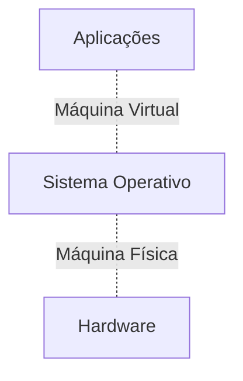

# 01. Introdução

${toc}

## 1. Conceitos Base
### 1.1. Usos 
- Suportar eficientemente as aplicações;
- Garantir segurança e fiabilidade das operações;
- Gerir recursos (e.g. interrupções, organização da memória):
	- Permite abstrair os recursos físicos, oferecendo às aplicações um conjunto de recursos lógicos.

### 1.2. Alternativas 
- As linguagens de programação podem produzir todo o código necessário para que um programa se execute sob o hardware:
	- o esforço de programação seria enorme;
	- um conjunto significativo de funções seria repetido;
	- não haveria politicas de segurança globais ou tolerância a faltas.

### 1.3. Missão 

- Criar uma VM sobre a máquina física que é _hardware independent_:
	- Ofecere os recursos lógicos básicos necessaŕios para o desenvolvimento de software;

|Recursos Lógicos|Recursos Físicos Virtualizados|
|----------------|--------------------------------|
|Processos|Processador|
|Espaços de endereçamento virtuais|RAM, MMU|
|Ficheiros|Discos e dispositivos de memória de massa|
|Periféricos virtuais|Periféricos físicos|
|Canais de comunicação|Partilha de memória, redes de dados|
|Utilizadores|Utilizadores humanos|

### 1.4. Critérios de Qualidade
- Desempenho: gestão eficiente dos recursos;
- Segurança: isolamento de utilizadores e partilha segura de recursos lógicos;
- Fiabilidade e Disponibilidade: detetar um conjunto de faltas e tolerar um conjunto de erros;
- Interface: disponibilizar uma API simples para facilitar a conceção das aplicações (e.g. manutenção e portabilidade);

---

## 2. Evolução

### 2.1. Processamento em Série
- Máquinas sem sistema operativo;
- _Hardware_ baseado em tubos de vácuo;
- I/O através de cartões perfurado e de lâmpadas, respetivamente.
- Aspetos negativos:
	- Baixa produtividade (programas introduzidos pelo utilizador);
	- Todas as operações eram definidas pelo programa.

### 2.2. Monitor de Controlo
- Atribuição de quotas de tempo de utilização da máquina a cada utilizador;
- Os programas podiam ser carregados, editados e verificados em memória;
- I/O através de comandos e fitas de papel perfuradas/fita magnética, respetivamente;
- Rotinas reutilizáveis;
- Composição:
	- Interpretador de uma linguagem de comando que permite a execução dos restantes módulos;
	- Compilador;
	- Assembler;
	- Linker;
	- Loader;
	- Rotinas utilitárias para o controlo de periféricos (e.g. consola, leitor de cartões, etc);
- Aspetos negativos:
	- Ineficiente:
		- Processador inativo durante maior parte do tempo, à espera de um comando ou I/O:
		- O tempo de execução era maioritariamente gasto nas operações de I/O;

### 2.3. Processamento em Lotes (_Batch_)

### 2.4. Multiprogramação
- Mecanismo de interrupções permite multiplexar o processador entre várias atividades concorrentes;
- Concorrência permite otimizar a utilização do processador (e.g. programa `program_one` acede ao disco e fica bloqueado enquanto o controlador de disco funciona; nesse tempo, o programa `program_two` pode ser executado pelo processador);

### 2.5. Tempo Partilhado
- Cria a ilusão que o computador está permanentemente disponível para o utilizador;
- Possível tendo em conta que a maioria das aplicações pouco utiliza o processador.
- Consequências:
	- Revisão dos algoritmos de escalonamento;
	- Definição de mecanismos de segurança;
	- Aparecimento dos _filesystems_.

### 2.6. Memória Virtual

- Elimina a restrição física imposta pelo tamanho da memõria física, permitindo um grau de multiprogramação superior;

### 2.7. Interface Gráfica

### 2.8. Sistemas Distribuídos
- Consequência do aparecimento de redes de computadores e sistemas abertos.
- Os sistemas operativos englobam funcionalidades de sistemas distribuídos (e.g. protocolos de rede e sistemas de ficheiros distribuído).

---

## 3. Tipos de Sistemas Operativos

- Tempo Virtual:
	- O tempo de execução dos programas não se relaciona com o tempo cronológico exterior ao _hardware_;
	- Sistemas habitualmente utilizados em computadores pessoais ou servidores (e.g. Windows, OSX, Linux).
- Tempo Real:
	- Tentam garantir que o computador produza uma resposta a um acontecimento externo num intervalo de tempo determinado (caso contrário, ocorre uma falha).

### 3.1. Tempo Real
- Apareceram para controlo de processos industriais;
- Atualmente usado também para jogos, sistemas de controlo em veículos (e.g. automóveis, aviões, etc.), mas sobretudo em sistemas embebidos;
- Oferta extensa:
	- VxWorks;
	- VRTX;
	- LynxOS.
- Requísitos diferentes para aplicações diferentes:
	- **Tempo real relaxado** (_soft real time_): permite respostas a determinados acontecimentos fora do intervalo de tempo especificado;
	- **Tempo real estrito** (_hard real time_): sistema onde o não cumprimento de um requisito temporal corresponde a uma falha;

### 3.2. Sistemas Embebidos
- _Software_ integrado com o _hardware_;
- O sistema não oferece uma API para desenvolver aplicações.
- Exemplos:
	- Symbian;
	- Windows CE;
	- PalmOS.

### 3.3. Sistemas Proprietários vs. Abertos
- Inicialmente, havia uma vasta oferta de sistemas operativos de tempo partilhado:
	- Todos eram proprietários, pelo que:
		- Tinham restrições na utilização e cópia;
		- Desenvolvidos pelo fabricante de hardware;
		- Código não _open-source_;
		- Forte corrente de dependência: aplicação, sistema operativo e plataforma.
